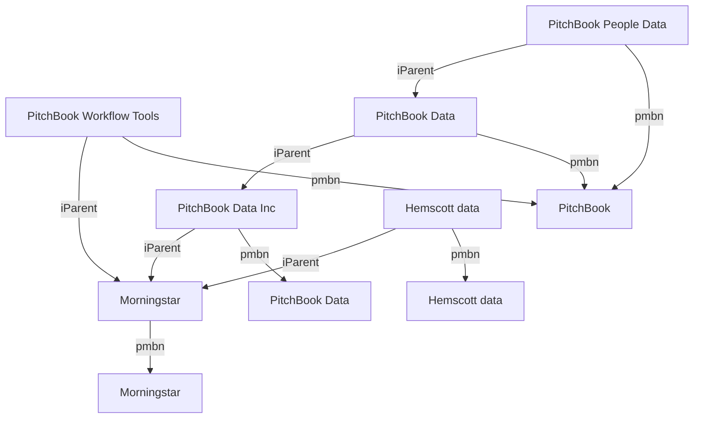

Raw Input

```mermaid
graph TD
    A[Morningstar] -->|pmbn| a[Morningstar]

    B[PitchBook Workflow Tools] -->|iParent| A
    B -->|pmbn| b[PitchBook]

    %% C[PitchBook Services] -->|iParent| A
    %% C -->|pmbn| b

    D[PitchBook Data Inc] -->|iParent| A
    D -->|pmbn| d[PitchBook Data]

    %% E[Morningstart Investment Services Inc] -->|iParent| A
    %% E -->|pmbn| e[Morningstart Investment Services]

    %% F[Morningstar Associates LLC] -->|iParent| A
    %% F -->|pmbn| f[Morningstar Associates]

    G[Hemscott data] -->|iParent| A
    G -->|pmbn| g[Hemscott data]

    %% H[PitchBook Private Equity & Venture Capital Data] -->|iParent| D
    %% H -->|pmbn| b

    %% I[PitchBook Platform] -->|iParent| D
    %% I -->|pmbn| b

    %% J[PitchBook PB Mobile App] -->|iParent| D
    %% J -->|pmbn| b

    K[PitchBook Data] -->|iParent| D
    K -->|pmbn| b

    %% L[PitchBook API & Datafeed] -->|iParent| D
    %% L -->|pmbn| b

    M[PitchBook People Data] -->|iParent| K
    M -->|pmbn| b

    %% N[PitchBook News & Analysis] -->|iParent| K
    %% N -->|pmbn| b

    %% O[PitchBook M&A Data] -->|iParent| K
    %% O -->|pmbn| b

    %% P[PitchBook Limited Partner Data] -->|iParent| K
    %% P -->|pmbn| b

    %% Q[PitchBook Investor Data] -->|iParent| K
    %% Q -->|pmbn| b

    %% R[PitchBook Fund Data] -->|iParent| K
    %% R -->|pmbn| b

    %% S[PitchBook Deal Data] -->|iParent| K
    %% S -->|pmbn| b

    %% T[PitchBook Company Data] -->|iParent| K
    %% T -->|pmbn| b

    %% U[PitchBook Advisor Data] -->|iParent| K
    %% U -->|pmbn| b

    %% V[Foobar] -->|iParent| K
    %% V -->|pmbn| z[Foo]

    %% Z[Foobar] -->|iParent| K
    %% Z -->|pmbn| z[Foo]
```
