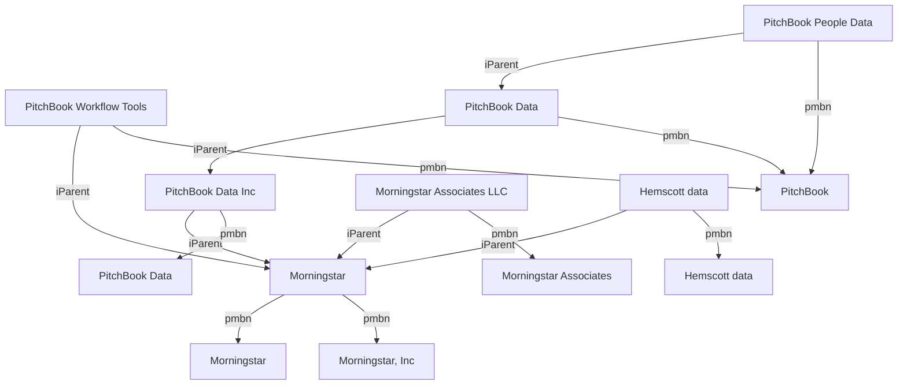
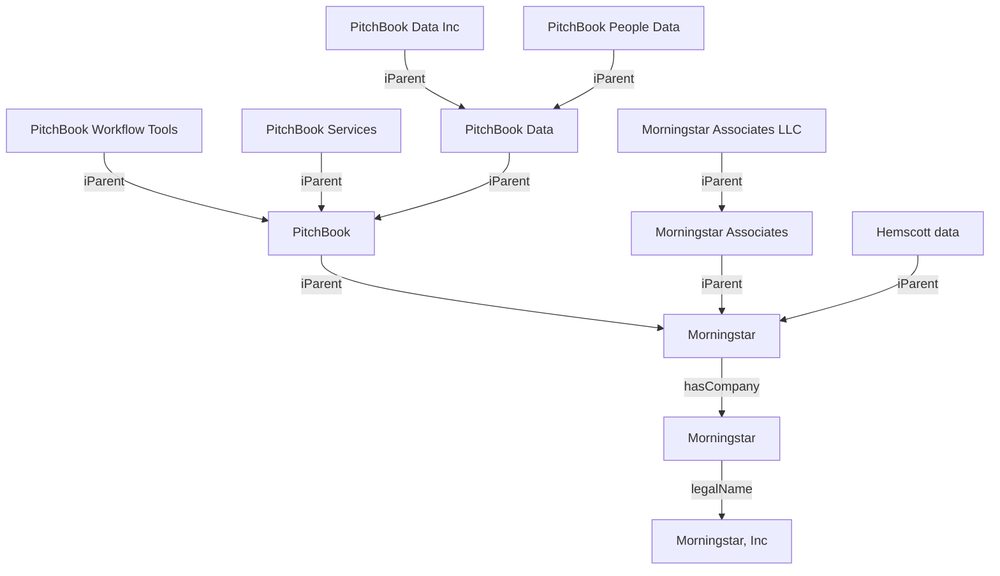

## Query

```sparql
prefix ibbeo: <https://ontologies.industrybuildingblocks.com/ibbeo/>
prefix ibbeox: <https://taxonomies.industrybuildingblocks.com/ibbeo/>
prefix ibbeod: <https://data.industrybuildingblocks.com/ibbeo/>
prefix skos: <http://www.w3.org/2004/02/skos/core#>
prefix gist: <https://ontologies.semanticarts.com/gist/>
prefix xsd: <http://www.w3.org/2001/XMLSchema#>

construct {
  ?topOrgSub ?topOrgPred ?topOrgObj .
  ?childOrgSub ?childOrgPred ?childOrdObj .
}
where {
  values ?topOrgSub {
    <https://data.industrybuildingblocks.com/ibbeo/_Organization_1075339>
  }
  {
    ?topOrgSub
      rdf:type ibbeo:IbbOrganization ;
      gist:isCategorizedBy ibbeox:_OrganizationLevel_TopParent ;
      ?topOrgPred ?topOrgObj ;
    .
    FILTER (
      ?topOrgPred IN (
        skos:prefLabel,
        ibbeo:primaryMarketBrandName
      )
    )
  }
  union
  {
    ?childOrgSub
      rdf:type ibbeo:IbbOrganization ;
      ibbeo:hasImmediateParent+ ?topOrgSub ;
      ?childOrgPred ?childOrdObj ;
    .
    FILTER (
      ?childOrgPred IN (
        skos:prefLabel,
        ibbeo:primaryMarketBrandName,
        ibbeo:hasImmediateParent
      )
    )
  }
}
order by ?topOrgSub ?topOrgPred ?childOrgSub ?childOrgPred
```

## Raw Input

Note: Duplicate cases were commented out to help simplify the diagram. See the raw mermaid text for complete graph.



## Desired Brand Hierarchy


Note: Duplicate cases were commented out to help simplify the diagram. See the raw mermaid text for complete graph.


